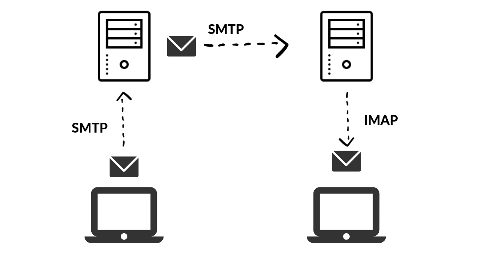

**Summary** 사이트의 기본적인 틀을 잡아둔 이후, 회원가입 시 이메일 인증과 같은 기능을 구현하기 위해 Django를 이용해 이메일을 보내는 방법을 찾아봤다. Django에 내장되어져 있는 SMTP 기능을 이용한 방법을 시도했지만, 보안 관련 문제점을 발견해 Gmail API를 통해 해결할 수 있었다. 비슷한 문제를 겪을 사람들에게 도움이 될 수 있을까하여, 그간의 과정들을 정리해보기로 했다.

###SMTP(Simple Mail Transfer Protocol)
SMTP란 인터넷에서 이메일을 보내기 위해 이용되는 프로토콜으로, 사용하는 TCP 포트번호는 25번이다. 상대 서버를 지시하기 위해서 DNS의 MX레코드가 사용된다. 메일 서버간의 송수신뿐만 아니라, 메일 클라이언트에서 메일 서버로 메일을 보낼 때에도 사용되는 경우가 많다.
SMTP는 텍스트 기반의 프로토콜로서 요구/응답 메시지뿐 아니라 모든 문자가 7bit ASCII로 되어있어야 한다고 규정되어 있다. 이 때문에 문자 표현에 8비트 이상의 코드를 사용하는 언어나 첨부파일과 자주 사용되는 각종 바이너리는 마임(MIME)이라고 불리는 방식으로 7비트로 변환되어 전달된다. [참고자료](https://en.wikipedia.org/wiki/Simple_Mail_Transfer_Protocol) [TCP 포트란?](#)




##Django 내장 SMTP를 통한 메일 보내기

Django에는 기본적으로 SMTP를 통해서 메일을 보낼 수 있는 기능이 내장되어 있다.
Gmail의 SMTP 서버를 이용해 메일을 전송하는 상황이라면 몇 가지 설정이 필요하다.

####GMail 계정 설정
+ [보안 수준이 낮은 앱 및 Google 계정 허용](https://myaccount.google.com/lesssecureapps?pli=1)

####Django 설정
이 후에는 Django의 Settings.py 파일 아래에 코드 몇줄을 추가해주면 설정이 완료된다.

```python
#settings.py

EMAIL_BACKEND = 'django.core.mail.backends.smtp.EmailBackend'
EMAIL_HOST = "smtp.gmail.com"
EMAIL_HOST_USER = 'user@gmail.com(위 설정에 사용한 GMail 계정)'
EMAIL_HOST_PASSWORD = 'password(위 설정에 사용한 GMail 비밀번호)'
EMAIL_PORT = 587
EMAIL_USE_TLS = True
DEFAULT_FROM_EMAIL = EMAIL_HOST_USER
```

메일을 보내는 코드는 다음과 같다.
```python
#views.py
from django.core.mail import EmailMessage

email = EmailMessage(
    'Hello',                # 제목
    'Body goes here',       # 내용
    'from@example.com',     # 보내는 이메일 (settings에서 설정해서 작성안해도 됨)
    to=['to1@example.com', 'to2@example.com'],  # 받는 이메일 리스트
)
email.send()
```

여기까지가 Django에서 내장되어 있는 함수를 이용해 SMTP 방식으로 메일을 전송하는 방법이었다. 하지만, 문제는 시간이 조금 지난 뒤에 발견되었는데, 먼 외국에서 내 Gmail 계정에 접속하려고 했다는 알림이 온 것이다. 자세한 원인까지는 알지 못했지만, 보안 수준이 낮은 앱 및 Google 계정 허용을 해두어 계정 보안이 많이 약해진 것이 걸렸다. 계정 비밀번호를 좀더 복잡하게 변경해두어도 몇일 뒤에 같은 알림이 왔다.

결국 위와 같은 방법은 문제가 있다고 판단이 들어 다른 방법을 찾던 도중, 상사인 형으로부터 Gmail API를 이용한 방법을 권유받았다. 이 방법을 이용하면 보안 수준이 낮은 앱 및 Google 계정을 허용해두지 않아도 메일을 전송할 수 있었다.

##Gmail API를 이용해서 메일 보내기

Gmail API를 이용할 때도 다른 여느 API를 이용할 때와 같이 Key를 발급받는 과정이 필요하다.
[링크](https://developers.google.com/gmail/api/quickstart/python)를 타고 들어가서 Step 2까지 진행하면 초기 세팅은 완료된다.

+ Step 1의 Enable the Gmail API 버튼을 클릭해 credentials.json 파일을 다운로드한다
+ Step 2의 명령어를 입력해 가상환경에 필요한 라이브러리를 다운로드한다

```python
pip install --upgrade google-api-python-client google-auth-httplib2 google-auth-oauthlib
```
이후에는 Gmail API 공식 문서에 작성되어져 있는 예제들을 보면서 필요에 맞게 프로젝트에 가져다 쓰면 된다. 다만, 본인은 문서가 Python 2로 작성되어져 있어 3버전으로 바꾸어 작성하는 것과, 이메일을 보내는데 필요한 여러가지 함수들이 산재되어 기록되어져 있는 탓에 꽤나 곤혹을 치뤘다. 

이에 파이썬 버전3에 맞게 다음과 같이 코드를 정리해두었다. 

```python
import httplib2
import os
import oauth2client
from oauth2client import client, tools, file
import base64
from email import encoders
import smtplib  
import mimetypes
from email import encoders
from email.message import Message
from email.mime.audio import MIMEAudio
from email.mime.base import MIMEBase
from email.mime.image import MIMEImage
from email.mime.multipart import MIMEMultipart
from email.mime.text import MIMEText
from email.mime.application import MIMEApplication
from apiclient import errors, discovery

def get_credentials():
  home_dir = os.path.expanduser('~') #>> C:\Users\Me
  credential_dir = os.path.join(home_dir, '.credentials') # >>C:\Users\Me\.credentials   (it's a folder)
  if not os.path.exists(credential_dir):
      os.makedirs(credential_dir)  #create folder if doesnt exist
  credential_path = os.path.join(credential_dir, 'cred send mail.json')
  store = oauth2client.file.Storage(credential_path)
  credentials = store.get()
  if not credentials or credentials.invalid:
      CLIENT_SECRET_FILE = 'credentials.json'
      APPLICATION_NAME = 'Gmail API Python Send Email'
      SCOPES = 'https://www.googleapis.com/auth/gmail.send'
      flow = client.flow_from_clientsecrets(CLIENT_SECRET_FILE, SCOPES)
      flow.user_agent = APPLICATION_NAME
      credentials = tools.run_flow(flow, store)
  return credentials

def create_message_and_send(sender, to, subject,  message_text_plain, message_text_html, attached_file):
    credentials = get_credentials()
    http = httplib2.Http()
    http = credentials.authorize(http)        #or: http = credentials.authorize(httplib2.Http())
    service = discovery.build('gmail', 'v1', http=http)
    message_without_attachment = create_message_without_attachment(sender, to, subject, message_text_html, message_text_plain)
    send_Message_without_attachement(service, "me", message_without_attachment, message_text_plain)

def create_message_without_attachment (sender, to, subject, message_text_html, message_text_plain):
    message = MIMEMultipart('alternative') # needed for both plain & HTML (the MIME type is multipart/alternative)
    message['Subject'] = subject
    message['From'] = sender
    message['To'] = to
    message.attach(MIMEText(message_text_plain, 'plain'))
    message.attach(MIMEText(message_text_html, 'html'))
    raw_message_no_attachment = base64.urlsafe_b64encode(message.as_bytes())
    raw_message_no_attachment = raw_message_no_attachment.decode()
    body  = {'raw': raw_message_no_attachment}
    return body

def create_Message_with_attachment(sender, to, subject, message_text_plain, message_text_html, attached_file):
    message = MIMEMultipart() #when alternative: no attach, but only plain_text
    message['to'] = to
    message['from'] = sender
    message['subject'] = subject
    message.attach(MIMEText(message_text_html, 'html'))
    message.attach(MIMEText(message_text_plain, 'plain'))
    my_mimetype, encoding = mimetypes.guess_type(attached_file)
    if my_mimetype is None or encoding is not None:
        my_mimetype = 'application/octet-stream' 

    main_type, sub_type = my_mimetype.split('/', 1)# split only at the first '/'

    if main_type == 'text':
        print("text")
        temp = open(attached_file, 'r')  # 'rb' will send this error: 'bytes' object has no attribute 'encode'
        attachement = MIMEText(temp.read(), _subtype=sub_type)
        temp.close()

    elif main_type == 'image':
        print("image")
        temp = open(attached_file, 'rb')
        attachement = MIMEImage(temp.read(), _subtype=sub_type)
        temp.close()

    elif main_type == 'audio':
        print("audio")
        temp = open(attached_file, 'rb')
        attachement = MIMEAudio(temp.read(), _subtype=sub_type)
        temp.close()            

    elif main_type == 'application' and sub_type == 'pdf':   
        temp = open(attached_file, 'rb')
        attachement = MIMEApplication(temp.read(), _subtype=sub_type)
        temp.close()

    else:                              
        attachement = MIMEBase(main_type, sub_type)
        temp = open(attached_file, 'rb')
        attachement.set_payload(temp.read())
        temp.close()

    encoders.encode_base64(attachement)  #https://docs.python.org/3/library/email-examples.html
    filename = os.path.basename(attached_file)
    attachement.add_header('Content-Disposition', 'attachment', filename=filename) # name preview in email
    message.attach(attachement) 

    message_as_bytes = message.as_bytes() # the message should converted from string to bytes.
    message_as_base64 = base64.urlsafe_b64encode(message_as_bytes) #encode in base64 (printable letters coding)
    raw = message_as_base64.decode()  # need to JSON serializable (no idea what does it means)
    return {'raw': raw} 

def send_Message_without_attachement(service, user_id, body, message_text_plain):
    try:
        message_sent = (service.users().messages().send(userId=user_id, body=body).execute())
        message_id = message_sent['id']
        # print(attached_file)
        print (f'Message sent (without attachment) \n\n Message Id: {message_id}\n\n Message:\n\n {message_text_plain}')
        # return body
    except errors.HttpError as error:
        print (f'An error occurred: {error}')

def send_Message_with_attachement(service, user_id, message_with_attachment, message_text_plain, attached_file):
    try:
        message_sent = (service.users().messages().send(userId=user_id, body=message_with_attachment).execute())
        message_id = message_sent['id']
    except errors.HttpError as error:
        print (f'An error occurred: {error}')

def main():
    to = email
    sender = "snowman"
    subject = "hello"
    message_text_html  = r'hello<br/> <b>감사합니다</b>'
    message_text_plain = "Hi\n"
    attached_file = r'C:\Users\Me\Desktop\audio.m4a'
    create_message_and_send(sender, to, subject, message_text_plain, message_text_html, attached_file)

if __name__ == '__main__':
        main()

main()
```

이 함수가 사용되는 파일과 같은 레벨에 이전에 다운로드 해둔 credentials.json 파일이 있어야지 실행이 가능하다.
또한, 위의 코드를 그냥 가져다가 실행하게 되면 오류가 뜨게 될 텐데, 이는 C:\Users\Me\.credentials 폴더에 인증을 위한 json 파일이 없어서 그렇다.
본인은 이를 해결하기 위해, 따로 Python 파일을 만들어, 위 코드를 실행시켜 json 파일을 생성시키는 방법을 택했다.
